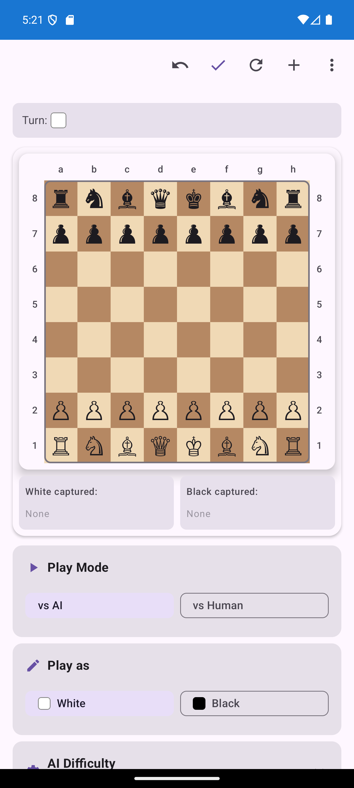

# ChessPredictor

<p align="center">
  
</p>

A chess app I built with **Kotlin Multiplatform** — runs on Android, iOS, and Web from a single shared codebase. You play against **Stockfish 17.1** with a twist: the AI can simulate human-like behavior instead of playing like a machine.

## How it works

The core chess logic lives in a shared Kotlin module — move validation, FEN parsing, castling, en passant, promotion, check/checkmate detection. All three platforms consume this through platform-specific UI layers.

**Stockfish** runs through a WebView-based JavaScript bridge on Android, direct JS on Web, and a native bridge on iOS. The app communicates with the engine over the **UCI protocol** — sends positions as FEN strings, receives best moves back with evaluation data.

The interesting part is the **human behavior system**. Instead of Stockfish always playing the objectively best move, the app injects realistic mistakes based on the selected difficulty (800–2400+ ELO). It simulates thinking time that scales with position complexity, tracks an emotional state (confident, worried, frustrated), and can offer commentary on moves. There are preset personalities — beginner enthusiast, calm positional player, tactical fighter, experienced teacher.

**Opening detection** recognizes what opening is being played in real-time from the move sequence.

Games can be saved, loaded, and exported as **PGN**, **JSON**, or **FEN**.

## Tech stack

**Shared (KMP):** Kotlin, Coroutines + StateFlow, Kotlinx Serialization, MVVM + clean architecture

**Android:** Jetpack Compose, Material3, DataStore, Stockfish via WebView JS bridge

**iOS:** SwiftUI, CocoaPods, native Stockfish bridge

**Web:** Kotlin/JS (IR), Webpack, Stockfish compiled with Emscripten

## Building

```bash
# Android
./gradlew :androidApp:assembleDebug

# iOS
cd iosApp && pod install
open iosApp.xcworkspace    # build from Xcode

# Web
./build-web.sh
```

## License

Apache 2.0
